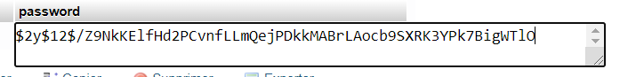

# Vetux-Line

Mission de développement d’une application métier (exploitation de documents CSV), de préférence sous la forme d’une
application web à base de framework.

Niveau : Deuxième année de BTS SIO SLAM

Prérequis : PHP 7 ou supérieur, Composer, FrameWork Symfony, Serveur Apache/MySQL.

Projet effectué du lundi 11 octobre 2021, au dimanche 31 octobre 2021 par Yannick MIDEY.

# Liens dépôts 

Présentation du projet : https://ocapuozzo.github.io/mission-etl-csv/

Dépôt GitHub : //todo

# Matériels utilisés

OS : Windows 10

IDE : PhpStorm 2021.2.1

Version Php : PHP 8.0.11

Version symfony : Symfony CLI version v4.26.6

Version Composer : Composer version 2.1.6

# Thématique

La société de service dans laquelle vous travaillez a comme client l’entreprise VETUX-LINE, créateur de ligne de vêtements.

La société VETUX-LINE reçoit de la part de ses partenaires, tous les mois, 2 fichiers clients au format CSV.

Afin d’exploiter ces fichiers partenaires, VETUX-LINE souhaite disposer d’un outil (une application) lui permettant de fusionner ces 2 fichiers en un fichier unique.

Les fichiers communiqués par l'entreprise french-client.csv (3000 clients) et german-client.csv (2000clients) possèdent le meme type et nombre de colonnes

# Première partie - Fusion ++

## Fusion :

Obtenir un seul fichier csv à partir de 2 fichiers csv.

## Projection : 

Toutes les colonnes ne sont pas concernées. Les colonnes souhaitées sont : genre, titre, nom, prénom, email, date de naissance, num tel, CCType, CCNumber, CVV2, CCExpires, adresse physique (plusieurs colonnes), taille, poids, véhicule, coordonnés GPS.

## Vérification :

* Seules les personnes majeures à la date de création du fichier devront être sélectionnées.

* Seules les personnes ne possédant pas d'incohérence de valeurs entre leur taille en cm et leur talle en feetinch devront être sélectionnés dans le fichier final

* Prise en compte de la Contrainte-de-ccn. L'entreprise Vetux-Line ne souhaite pas que ses clients possèdent un code de carte de crédit en doublon avec un autre client. Les clients qui ne possèdent donc pas un code de carte de crédit unique devront donc être retiré 

## Choix de tri : 

Considérons les fichiers suivants fichier A et fichier B, respectivement de 4 et 2 éléments :

    Fic A : * * * *
    Fic B : ° °

La fusion de ces 2 fichiers csv sera effectué par un algorithme séquentiel ou entrelacé


# Deuxième partie - Etl

L’entreprise VETUX-LINE envisage de se lancer dans des produits en liens avec l’automobile. Le département R&D souhaite disposer d’un modèle de données suivant :


Ce qui est attendu à l’issue de la seconde partie : 

##### A/ Conception de la partie Model (ajout d’entités)

##### B/ Lien avec un serveur de base de données (MySql)

##### C/ Conception d’une fonction ELT (Extract Transform Load).

##### D/ Application de la fonction ETL dans un contrôleur. Mise au point d’un scénario utilisateur intégrant des règles de validation (robustesse de l’application)

##### E/ Prise en compte de scénarios à risque, formulés sous la forme simple d'Evil User Stories et leur contre-mesure. Voir exemple ici : https://www.riskinsight-wavestone.com/2019/12/cybersecurity-transformation-agile/

##### F/ L’utilisateur pourra être en mesure de renouveler son action avec de nouvelles données ou des données mises à jour. Le chargement de nouvelles données ne devra pas générer de doublons dans la base de données.

##### G/ Une représentation graphique de données statistiques (répartition des marques parmi les clients) est attendue sur le tiers client. Les données exploitées pour cette représentation seront tirées de la base de donnes. À vous de proposer une vue adaptée pour le service R&D.

# Installation et configuration

## Installation du projet
Ouvrer le terminal git bash, et effectuez la commande :
>git clone //todo

Puis, entrer dans le répertoire du projet avec la commande :
> cd Vetux-line

Ensuite pour récupérer toutes les librairies du projet, effectuer les commandes :
> composer install
> 
>composer update

## Création et configuration de la base de données

* Dans une application de gestion de base de donnée comme phpMyAdmin, créer un utilisateur nommé Vetuxline avec le mot de passe sio puis cocher la case "Créer une base portant son nom et donner à cet utilisateur tous les privilèges sur cette base"

* Vérifier, dans le fichier .env que le système de gestion de base de données ainsi que sa version est bien celui que vous utilisez sinon ajoutez le vôtre.

* Création des différentes tables
> php bin/console doctrine:migrations:migrate

## Création de l'utilisateur 

Grâce au fichier préalablement crée nommé <code>AppFixture</code> situé dans <code>\src\DataFixture</code>.

````php
<?php

# Nom du package
namespace App\DataFixtures;

# Importation des classes nécessaires
use App\Entity\Admin;
use Doctrine\Bundle\FixturesBundle\Fixture;
use Doctrine\Persistence\ObjectManager;
use Symfony\Component\Security\Core\Encoder\UserPasswordEncoderInterface;

# Nom de la classe
class AppFixtures extends Fixture
{
    # Déclaration des attributs
    private $passwordEncoder;

    # On encode l'attribut passwordEncorder avec un système de hachage provenant
    # de la classe UserPasswordEncoderInterface de la librairie doctrine
    public function __construct(UserPasswordEncoderInterface $passwordEncoder){
        $this->passwordEncoder = $passwordEncoder;
    }

    public function load(ObjectManager $manager)
    {
        # On appelle la classe Admin situé dans App\Entity\Admin
        $user = new Admin();
        # Appel de la méthode setUsername avec en paramètre la chaine de
        # caractère root de l'objet référencé par user
        $user->setUsername("root");
        # Appel de la méthode setPassword avec en paramètre l'attribut passwordEncoder et avec comme paramètre la fonction encodePassword($user, "sio"));
        $user->setPassword($this->passwordEncoder->encodePassword($user, "sio"));
        # On notifie doctrine avec la méthode persist en lui disant que
        # l'on voudrait ajouter les valeurs que contient la variable $user
        # dans la base de données
        $manager->persist($user);
        # Avec la méthode flush de doctrine, on met à jour notre base de données
        $manager->flush();
    }
}
````
En effectuant la commande :
> php bin/console doctrine:fixtures:load
>
> yes

Un utilisateur qui aura par défaut le login 'root' et le mot de passe 'sio' sera directement créé dans la table admin de la base de données.

# Première partie - Fusion ++

## Login 

D'après le context du projet, l'application devra être protégée. J'ai donc mit en place une page de login avec un formulaire avec une entrée nom d'utilisateur et une entrée mot de passe.


En appuyant sur le bouton "se connecter", on fait appel aux différentes fonctions du fichier <code>LogInFormAuthenticator</code> situé dans le répertoire <code>src\Security</code> qui vont lire les données envoyées dans le formulaire login et qui vont les comparer aux données de la table Admin de la base de données VetuxLine.
Si la comparaison répond vrai, les données envoyées dans le formulaire sont donc bonne, l'utilisateur sera donc redirigé sur la page 'admin/tableau/client' notre page 'index'. 

Si la comparaison répond faux, les données envoyées dans le formulaire sont donc mauvaise, l'utilisateur restera sur la page login et il recevra un message flash d'erreur.


## Fusion


1. Choix du type de fusion


2. Choix des fichiers à fusionner


3. Envoi des données

La route <code>admin/fusion</code> fait appel à un formulaire construit dans le fichier <code>MergeCsvForm</code>. Ce formulaire permet de restreinte les extensions des fichiers grâce à un système de <code>mimeTypes</code>. 

````php
<?php

namespace App\Form;

use Symfony\Component\Form\AbstractType;
use Symfony\Component\Form\Extension\Core\Type\ChoiceType;
use Symfony\Component\Form\Extension\Core\Type\FileType;
use Symfony\Component\Form\Extension\Core\Type\TextType;
use Symfony\Component\Form\FormBuilderInterface;
use Symfony\Component\OptionsResolver\OptionsResolver;
use Symfony\Component\Validator\Constraints\File;
use Symfony\Component\Validator\Constraints\NotBlank;

class MergeCsvForm extends AbstractType
{
    public function buildForm(FormBuilderInterface $builder, array $options)
    {
        $builder
            ->add('type', ChoiceType::class, [
                "label" => "Type de fusion",
                'choices'  => [
                    'Séquentiel' => "Séquentiel",
                    'Entrelacé' => "Entrelacé"
                ]
            ])
            ->add('csv1', FileType::class, [
                "label" => "CSV 1",
                "constraints" => [
                    new NotBlank(),
                    new File([
                        'mimeTypes' => [
                            'text/x-csv',
                            'text/csv',
                            'application/x-csv',
                            'application/csv',],
                        "mimeTypesMessage" => "Seul les fichiers Csv sont autorisées !"
                    ])
                ]
            ])
            ->add('csv2', FileType::class, [
                "label" => "CSV 2",
                "constraints" => [
                    new NotBlank(),
                    new File([
                        'mimeTypes' => [
                            'text/x-csv',
                            'text/csv',
                            'application/x-csv',
                            'application/csv',],
                        "mimeTypesMessage" => "Seul les fichiers Csv sont autorisées !"
                    ])
                ]
            ])
            ->setMethod("POST")
        ;
    }

    public function configureOptions(OptionsResolver $resolver)
    {
        $resolver->setDefaults([
            // Configure your form options here
        ]);
    }

}
````

Ce formulaire donne donc le choix entre deux types de fusion, le type de fusion séquentiel et le type de fusion entrelacé.

Afin de faire des tests, dans le dossier <code>public/Data</code> vous pourrez retrouver 4 fichiers csv, les fichiers des clients français et allemands de base ainsi qu'un fichier contenant 12 clients français <code>small-french-client.csv</code> et un fichier contenant 8 clients allemands <code>small-german-client</code>.

Suite à l'envoi du formulaire par le client, Le contrôleur 
<code>IndexController</code> (<code>src/Controller/IndexController.php</code>) par sa fonction <code>merge</code> se chargera de récupérer la requête soumise, et de faire appel aux différents services mis en place. 

/!\ De nombreuses informations sont données dans les commentaires du code, pour une meilleure compréhension, il est recommandé de les lires /!\
````php
    /**
     * @Route("fusion", name="merge")
     */
    public function merge(Request $request)
    {
        # On appelle formulaire situé dans la classe MergeCsvForm
        $csvMergeForm = $this->createForm(MergeCsvForm::class);
        $csvMergeForm->handleRequest($request);

        # On vérifie que le formulaire a été renvoyé et qu'il est valide (fichier Csv uniquement)
        if ($csvMergeForm->isSubmitted() && $csvMergeForm->isValid()) {

            # On récupère dans la variable $csv1Data les données envoyées dans la valeur post csv1
            $csv1Data = $csvMergeForm['csv1']->getData();
            # On récupère dans la variable $csv2Data les données envoyées dans la valeur post csv2
            $csv2Data = $csvMergeForm['csv2']->getData();

            # On vérifie avec la variable isValidCsvHeader de la classe Csv, si l'en-tête des données de la variable $csv1data
            # n'est pas égal à l'en-tête du retour de la fonction getSpecificColumn situé dans la classe Csv
            if (!Csv::isValidCsvHeader(Csv::getCsvHeader($csv1Data))) {
                # Si l'en-tête de $csv1Data n'est bien pas égal à l'en-tete de getSpecificColumn, on renvoie
                # un message flash à l'utilisateur
                $this->addFlash("error", "Le fichier Csv 1 ne contient pas toutes les colonnes nécessaire à la fusion");
                # Puis, on le redirige à la route 'admin_merge'
                $this->redirectToRoute("admin_merge");
            }

            # On vérifie avec la variable isValidCsvHeader de la classe Csv, si l'en-tête des données de la variable $csv2Data
            # n'est pas égal à l'en-tête du retour de la fonction getSpecificColumn situé dans la classe Csv
            if (!Csv::isValidCsvHeader(Csv::getCsvHeader($csv2Data))) {
                # Si l'en-tête de $csv1Data n'est bien pas égal à l'en-tete de getSpecificColumn, on renvoie
                # un message flash de type erreur à l'utilisateur
                $this->addFlash("error", "Le fichier Csv 2 ne contient pas toutes les colonnes nécessaire à la fusion");
                # Puis, on le redirige à la route 'admin_merge'
                $this->redirectToRoute("admin_merge");
            }

            # On appelle le constructeur Merge (App\Service\Merge) en lui donnant comme paramètre $csv1Data et $csv2Data
            $merge = new Merge($csv1Data, $csv2Data);

            # On vérifie si la valeur envoyé en post nommé type est égal à "Séquentiel"
            if ($csvMergeForm["type"]->getData() == "Séquentiel") {
                # Si c'est le cas, dans la variable $fusionSequenciel, on appelle la fonction sequential située dans la classe Service\Merge avec comme paramètre $merge
                $fusionSequenciel = $merge->sequential();
                # On vérifie que la variable $fusionSequenciel n'est pas vide
                if ($fusionSequenciel) {
                    # Si, elle ne l'est pas, on appelle la fonction download de la classe Merge
                    # qui aura pour but de télécharger les données situé dans ma variable $merge
                    # en fichier Csv
                    $merge->downloadCsv();
                } else {
                    # Si, la variable $fusionSequenciel est vide, ce qui veut dire qu'aucun client a été ajouté au fichier final
                    # on renvoie un message flash de type erreur à l'utilisateur
                    $this->addFlash("error", "La fusion des fichiers n'a pas abouti, toutes les données des clients étaient vides ou contenaient des données invalides");
                    # Puis, on le redirige à la route 'admin_merge'
                    $this->redirectToRoute("admin_merge");
                }
            }

            # On vérifie si la valeur envoyé en post nommé type est égal à "Séquentiel"
            if ($csvMergeForm["type"]->getData() == "Entrelacé") {
                # Si c'est le cas, dans la variable $fusionEntrelace, on appelle la fonction interlaced situé dans la classe Service\Merge avec comme paramètre $merge
                $fusionEntrelace = $merge->interlaced();
                # On vérifie que la variable $fusionSequenciel n'est pas vide
                if ($fusionEntrelace) {
                    # Si, elle ne l'est pas, on appelle la fonction download de la classe Merge
                    # qui aura pour but de télécharger les données situé dans ma variable $merge
                    # en fichier Csv
                    $merge->downloadCsv();
                } else {
                    # Si, la variable $fusionSequenciel est vide, ce qui veut dire qu'aucun client a été ajouté au fichier final
                    # on renvoie un message flash de type erreur à l'utilisateur
                    $this->addFlash("error", "La fusion des fichiers n'a pas abouti, toutes les données des clients étaient vides ou contenaient des données invalides");
                    # Puis, on le redirige à la route 'admin_merge'
                    $this->redirectToRoute("admin_merge");
                }
            }

            return new Response();
        }

        # On envoie le formulaire à l'utilisateur
        return $this->render('admin/fusion.html.twig', [
            "mergeCsvForm" => $csvMergeForm->createView()]);
    }
````
Dans la variable <code>$merge</code> nous allons appeler le constructeur Merge de la classe Merge (<code>src\Service\Merge</code>), en lui donnant comme paramètre les données du fichier csv 1 (variable <code>$csv1Data</code>) et les données du fichier csv 2 (variable <code>$csv2Data</code>)

Nous allons d'abord vérifier que les deux fichiers envoyés par l'utilisateur possède bien les colonnes nécessaires à la fusion, en appellant deux fois la méthode <code>IsValidCsvHeader</code> de la classe Csv. Une première fois, avec l'attribut <code>csv1Data</code> puis une seconde fois, avec l'attribut <code>csv2Data</code>

````php 
if (!Csv::isValidCsvHeader(Csv::getCsvHeader($csv1Data))) {
                # Si l'en-tête de $csv1Data n'est bien pas égal à l'en-tete de getSpecificColumn, on renvoie
                # un message flash à l'utilisateur
                $this->addFlash("error", "Le fichier Csv 1 ne contient pas toutes les colonnes nécessaire à la fusion");
                # Puis, on le redirige à la route 'admin_merge'
                $this->redirectToRoute("admin_merge");
            }

            # On vérifie avec la variable isValidCsvHeader de la classe Csv, si l'en-tête des données de la variable $csv2Data
            # n'est pas égal à l'en-tête du retour de la fonction getSpecificColumn situé dans la classe Csv
            if (!Csv::isValidCsvHeader(Csv::getCsvHeader($csv2Data))) {
                # Si l'en-tête de $csv1Data n'est bien pas égal à l'en-tete de getSpecificColumn, on renvoie
                # un message flash de type erreur à l'utilisateur
                $this->addFlash("error", "Le fichier Csv 2 ne contient pas toutes les colonnes nécessaire à la fusion");
                # Puis, on le redirige à la route 'admin_merge'
                $this->redirectToRoute("admin_merge");
            }
````

Méthode <code>isValidCsvHeader</code> :

````php 
/**
     * @param $uploadedCsvHeader
     * @return bool Vrai (true) si le header du Csv est valide sinon Faux (false)
     */
    public static function isValidCsvHeader($uploadedCsvHeader): bool
    {
        # Déclaration de l'attribut $uploadedCsvHeader avec comme argument la valeur de retour de array_map avec comme paramètre $uploadedCsvHeader
        $uploadedCsvHeader = array_map('strtolower', $uploadedCsvHeader);
        $i = 0;
        # Déclaration de l'attribut $csvColums avec comme argument la valeur de retour de array_map avec comme paramètre le retour de
        # la fonction getSpecificColums de la classe Csv
        $csvColumns = array_map('strtolower', Csv::getSpecificColumns());
        # On lit chaque valeur du tableau $uploadedCsvHeader
        foreach ($uploadedCsvHeader as $value) {
            # Si la valeur lut correspond à la valeur située dans le tableau $csvColums on ajoute +1 à la variable $i
            if (in_array($value, $csvColumns)) {
                $i++;
            }
        }
        # On retourne True si $i est égal à la valeur retournée de count $csvColums sinon False
        return $i === count($csvColumns);
    }
````

Cette méthode compare le tableau de la méthode <code>getSpecificColumns</code> avec le tableau envoyé en paramètre <code>$uploadedCsvHeader</code>. Grâce à une boucle 'foreach', elle va lire chaque valeur du tableau <code>$uploadedCsvHeader</Code> puis avec la fonction <code>in_array</Code>, elle va vérifier si la valeur existe dans le tableau de la variable <code>$csvColums</code>. Si la valeur existe, la variable <code>$i</code> sera post-incrémenté. Puis enfin, la méthode <code>isValidCsvHeader</code> va comparer le nombre clé dans le tableau <code>$csvColums</code> à la valeur de la variable <code>$i</code>, si la valeur et le nombre de clés est pareil, la méthode retournera 'true' sinon 'false'.

Méthode <code>getSpecificColums</Code> :

````php 
    /**
     * @return array avec seulement les colonnes spécifiques
     */
    public static function getSpecificColumns(): array
    {
        return ['Gender', 'Title', 'Surname', 'GivenName', 'EmailAddress', 'Birthday', 'TelephoneNumber', 'CCType', 'CCNumber', 'CVV2', 'CCExpires', 'StreetAddress', 'City', 'ZipCode', 'CountryFull', 'Centimeters', 'Kilograms', 'Vehicle', 'Latitude', 'Longitude'];
    }
````


Si les deux fichiers csv envoyé par l'utilisateur possèdent bien les colonnes nécessaires à la fusion, nous allons ensuite selon le type de tri sélectionné par l'utilisateur, appeler avec la variable <code>$merge</code> soit la méthode <code>sequential</code> si le choix du tri est séquentiel ou soit la méthode <code>interlaced</code> si le choix du tri est entrelacé, situé dans la classe Merge (<code>src\Service\Merge</code>)

Si le choix est séquentiel, la méthode<code>séquential</code> est appelé :
````php
    /**
     * @return bool
     */
    public function sequential(): bool
    {
        # On appelle la fonction insertIntoCsvForSequential en passent comme argument csv1 transformé en tableau grâce à la fonction
        # getRecords de la librairie PHP-League/CSV
        $this->insertIntoCsvForSequential($this->csv1->getRecords());
        # On appelle la fonction insertIntoCsvForSequential en passent comme argument csv2 transformé en tableau grâce à la fonction
        # getRecords de la librairie PHP-League/CSV
        $this->insertIntoCsvForSequential($this->csv2->getRecords());
        # On retourne un booléen, true si au moins un client a été ajouté, false si aucun n'a été ajouté
        return $this->clientAjouter === 1;
    }
````

Cette méthode appelle deux fois la méthode <code>insertIntoCsvForSequential</code>, une première fois avec les données reçue dans l'attribut <code>csv1</code> puis une seconde fois avec les données reçue dans l'attribut <code>csv2</code>, puis enfin elle retourne un booléen, true si l'attribut <code>clientAjouter</code> est strictement égal à 1 sinon false.

Méthode insertIntoCsvForSequential

/!\ De nombreuses informations sont données dans les commentaires du code, pour une meilleure compréhension, il est recommandé de les lires /!\

````php
private function insertIntoCsvForSequential($csvData)
    {
        # On lit chaque valeur du tableau envoyé en paramètre ($csvData)
        foreach ($csvData as $data) {
            $data = array_change_key_case($data, CASE_LOWER);
            # Déclaration du tableau $content
            $content = [];
            # On lit chaque valeur du tableau $column
            foreach ($this->columns as $column) {
                # Chaque valeur lut est ajouté au tableau $content
                $content[] = $data[$column];
            }

            # On vérifie si le client est adulte avec la fonction estAdulte, s'il a une taille valide avec la fonction aUneTailleValide
            # et si le code de sa carte de crédit est unique avec la fonction getDuplicateValueInArray
            if (Verification::estAdulte($data["birthday"]) && Verification::aUneTailleValide($data["feetinches"], $data["centimeters"]) && !in_array($data["ccnumber"], Csv::getDuplicateValueInArray($this->arrayOfCsvCcNumber))) {
                # Si le client, réussi à passer tous ses tests, il est ajouté avec la fonction insertOne de la librairie PHP-League/CSV au fichier de fusion mergeCsv
                $this->mergeCsv->insertOne($content);
                # Un client est ajouté, la valeur de l'attribut clientAjouter passe donc a 1
                $this->clientAjouter = 1;
            }
        }
    }
````

Si le choix est entrelacé, la fonction <code>interlaced</code> est appelé :

/!\ De nombreuses informations sont données dans les commentaires du code, pour une meilleure compréhension, il est recommandé de les lires /!\
````php 
    /**
     * @return bool
     */
    public function interlaced(): bool
    {
        # Si le nombre de lignes dans le tableau csv1 est supérieur au tableau csv2,
        # la variable $max aura comme valeur, le nombre de lignes du tableau csv1 sinon
        # elle aura comme valeur le nombre de lignes du tableau csv2
        $max = ($this->csv1->count() > $this->csv2->count()) ? $this->csv1->count() : $this->csv2->count();
        $csv1Index = 0;
        $csv2Index = 0;

        # Boucles do-while qui se lancera tant que la variable $max sera supérieur à 0
        do {
            # Variable pour vérifier si un client de fichier csv1 a été ajouté au fichier final
            $customerIsInserted = false;
            # Boucle while qui se lancera tant que la variable $customerIsInserted sera égal à false
            # et que la variable $csv1Index sera inférieur au nombre de données dans le tableau csv1
            while ($customerIsInserted == false && $csv1Index < $this->csv1->count()) {
                # Déclaration du tableau $content
                $content = [];
                # On lit chaque valeur du tableau $column envoyé en paramètre
                foreach ($this->columns as $column) {
                    # On change chaque clé de la ligne x (valeur $csv1Index) du tableau csv1 en minuscule
                    $data = array_change_key_case($this->csv1->fetchOne($csv1Index), CASE_LOWER);
                    # Chaque valeur lut avec la clé "column" du tableau $data est ajouté dans le tableau $content
                    $content[] = $data[$column];
                }
                # On vérifie si le client est adulte avec la fonction estAdulte, s'il a une taille valide avec la fonction aUneTailleValide
                # et si le code de sa carte de crédit est unique avec la fonction getDuplicateValueInArray
                if (Verification::estAdulte($data["birthday"]) && Verification::aUneTailleValide($data["feetinches"], $data["centimeters"]) && !in_array($data["ccnumber"], Csv::getDuplicateValueInArray($this->arrayOfCsvCcNumber))) {
                    # Si le client, réussi à passer tous ses tests, il est ajouté avec la fonction insertOne de la librairie PHP-League/CSV au tableau $content
                    $this->mergeCsv->insertOne($content);
                    # Un client est ajouté, la valeur de la variable $customerIsInserted passe donc en true
                    $customerIsInserted = true;
                    # Un client est ajouté, la valeur de l'attribut clientAjouter passe donc a 1
                    $this->clientAjouter = 1;
                }
                # On post-incrémente la variable $csv1Index
                $csv1Index++;
            }
            # On remet la variable $customerIsInserted à false pour vérifier si un client du fichier csv2 a été ajouté au fichier final
            $customerIsInserted = false;
            # Boucle while qui se lancera tant que la variable $customerIsInserted sera égal à false
            # et que la variable $csv1Index sera inférieur au nombre de données dans le tableau csv2
            while ($customerIsInserted == false && $csv2Index < $this->csv2->count()) {
                # Déclaration du tableau $content
                $content = [];
                # On lit chaque valeur du tableau $column envoyé en paramètre
                foreach ($this->columns as $column) {
                    # On change chaque clé de la ligne x (valeur $csv2Index) du tableau csv2 en minuscule
                    $data = array_change_key_case($this->csv2->fetchOne($csv2Index), CASE_LOWER);
                    # Chaque valeur lut avec la clé "column" du tableau $data est ajouté dans le tableau $content
                    $content[] = $data[$column];
                }
                # On vérifie si le client est adulte avec la fonction estAdulte, s'il a une taille valide avec la fonction aUneTailleValide
                # et si le code de sa carte de crédit est unique avec la fonction getDuplicateValueInArray
                if (Verification::estAdulte($data["birthday"]) &&  Verification::aUneTailleValide($data["feetinches"], $data["centimeters"]) && !in_array($data["ccnumber"], Csv::getDuplicateValueInArray($this->arrayOfCsvCcNumber))) {
                    # Si le client, réussi à passer tous ses tests, il est ajouté avec la fonction insertOne de la librairie PHP-League/CSV au tableau $content
                    $this->mergeCsv->insertOne($content);
                    # Un client est ajouté, la valeur de la variable $customerIsInserted passe donc en true
                    $customerIsInserted = true;
                    # Un client est ajouté, la valeur de l'attribut clientAjouter passe donc a 1
                    $this->clientAjouter = 1;
                }
                # On post-incrémente la variable $csv1Index
                $csv2Index++;
            }

            # On post-décrémente la variable $max
            $max--;
        } while ($max > 0);
        # On retourne un booléen, true si au moins un client a été ajouté, false si aucun n'a été ajouté
        return $this->clientAjouter === 1;
    }
````
Afin de faire les vérifications nécessaires pour supprimer les clients invalides dans le fichier final, nous allons appeler les méthodes suivantes :

<code>estAdulte</code> situé dans la classe <code>Verification</code> (<code>/src/Service/Verification.php</code>). Elle aura pour but de vérifier que le client est majeure en utilisant une soustraction de date.

````php 
/**
     * @param $dateCli
     * @return bool
     */
    public static function estAdulte($dateCli): bool
    {
        # Déclaration de la variable $dateClient avec comme valeur le retour du constructeur DateTime avec comme paramètre $dateCli
        $dateClient = new \DateTime($dateCli);
        # Déclaration de la variable $today avec comme valeur le retour du constructeur DateTime avec comme paramètre 'now'
        $today = new \DateTime('now');
        # Déclaration de la variable $diff avec comme valeur le retour de la fonction DateTime::diff avec comme paramètre la variable $today et $dateClient
        $diff = $today->diff($dateClient);
        # On transforme la valeur contenue dans la variable $diff en âge puis, on la donne comme argument à la variable $age
        $age = $diff->y;
        # On vérifie si la valeur contenue dans la variable $age est supérieur ou égal à 18
        if ($age >= 18) {
            # Si, la valeur est bien supérieure ou égal, on retourne vrai (true)
            return true;
        }
        # Sinon, on retourne faux (false)
        return false;
    }
````

<code>aUneTailleValide</code> situé dans la classe <code>Verification</code> (<code>/src/Service/Verification.php</code>). Elle aura pour but de vérifier que le client possède une taille en cm et une taille en feetinch identique.

````php 
/**
     * @param $inch
     * @param $cm
     * @return bool
     */
    public static function aUneTailleValide($inch, $cm): bool
    {
        # Déclaration de la variable $inches avec comme valeur le retour du calcul (donnée dans la variable $cm / 2.54)
        $inches = $cm / 2.54;
        # Déclaration de la variable $feet avec comme valeur le retour du calcul (donnée dans la variable $inches / 12) arrondie à une valeur numérique entière
        $feet = intval($inches / 12);
        $inches = $inches % 12;
        return sprintf("%d" . "' " . "%d" . '"', $feet, $inches) === $inch;
    }
````

<code>getDuplicateValueInArray</code> situé dans la classe <code>Csv</code> (<code>/src/Service/Csv.php</code>). Elle aura pour but de renvoyer un tableau avec uniquement les valeurs trouvées en double.

````php 
/**
     * @param $array
     * @return array $rValue
     */
    public static function getDuplicateValueInArray($array): array
    {
        # Déclaration d'un tableau vide stocker dans la variable $arrayOfCcNumber
        $rValue = [];
        # Déclaration d'un tableau array_unique avec comme paramètre les valeurs du tableau $array
        $arrayUnique = array_unique($array);
        
        if (count($array) - count($arrayUnique)) {
            for ($i = 0; $i < count($array); $i++) {
                if (!array_key_exists($i, $arrayUnique)) {
                    $rValue[] = $array[$i];
                }
            }
        }

        return array_unique($rValue);
    }
````

Ensuite dans le fichier <code>IndexController</code>, avec la variable <code>$fusionSequenciel</code> ou <code>$fusionEntrelace</code> on vérifie que des données ont bien été reçu.

Pour l'exemple, nous allons utiliser la variable <code>$fusionSequenciel</code>
````php 
if ($fusionSequenciel) {
````
Si l'instruction conditionnel 'if' renvoi true, on fait appel à la méthode <code>download</code> avec comme paramètre la fonction <code>$merge</code>

````php 
$merge->downloadCsv();
````
fonction downloadCsv (<code>/src/Service/Merge.php</code>) 

````php
    public function downloadCsv($nomCsv = "french-german-client-"): int
    {
        # On retourne les valeurs de l'attribut mergeCsv avec la fonction output de la librairie
        # PHP-League/Csv en lui donner comme paramètre (comme nom), la valeur de la variable $nomCsv
        # + la date d'aujourd'hui en format (Y-m-d) avec la fonction date puis .csv afin de lui donner
        # le format csv au téléchargement
        return $this->mergeCsv->output($nomCsv . date('Y-m-d') . '.csv');
    }
````

En contrepartie, si l'instruction conditionnel 'if' renvoi false, ce qui veut dire que la fonction <code>sequential</code> à retourner false, l'utilisateur recevra un message flash d'erreur et il sera redirigé sur la route <code>/admin/fusion</code>

````php
} else {
                    # Si, la variable $fusionSequenciel est vide, ce qui veut dire qu'aucun client a été ajouté au fichier final
                    # on renvoie un message flash de type erreur à l'utilisateur
                    $this->addFlash("error", "La fusion des fichiers n'a pas abouti, toutes les données des clients étaient vides ou contenaient des données invalides");
                    # Puis, on le redirige à la route 'admin_merge'
                    $this->redirectToRoute("admin_merge");
                }
````

## Fusion invalide


1. Entrée du fichier à trier


2. Choix du type de tri


3. Envoi des données

La route <code>admin/invalide/client</code> fait appel à un formulaire construit dans le fichier <code>InvalidCsvForm</code>. Ce formulaire permet de restreinte les extensions des fichiers grâce à un système de <code>mimeTypes</code>.

````php 
namespace App\Form;

use Symfony\Component\Form\AbstractType;
use Symfony\Component\Form\Extension\Core\Type\ChoiceType;
use Symfony\Component\Form\Extension\Core\Type\FileType;
use Symfony\Component\Form\FormBuilderInterface;
use Symfony\Component\OptionsResolver\OptionsResolver;
use Symfony\Component\Validator\Constraints\File;
use Symfony\Component\Validator\Constraints\NotBlank;

class InvalidCsvForm extends AbstractType
{
    public function buildForm(FormBuilderInterface $builder, array $options)
    {

        $builder
            ->add('type', ChoiceType::class, [
                "label" => "Type de tri",
                'choices' => [
                    'Tout les clients invalides' => "allClient",
                    'Client non majeur' => "notMajor",
                    'Client avec un taille en inch et une taille en cm qui ne correspondent pas ' => "invalidSize",
                    'Client avec un code de carte de crédit en doublon avec un autre client' => "invalidCcNumber",
                ]
            ])
            ->add('csv', FileType::class, [
                "label" => "CSV",
                "constraints" => [
                    new NotBlank(),
                    new File([
                        'mimeTypes' => [
                            'text/x-csv',
                            'text/csv',
                            'application/x-csv',
                            'application/csv',],
                        "mimeTypesMessage" => "Seul les fichiers Csv sont autorisées !"
                    ])
                ]
            ])
            ->setMethod("POST");
    }
}
````
Ce formulaire permet donc le choix entre différents types de tri, l'utilisateur pourra choisir d'avoir dans son fichier final : 
* Uniquement les clients possédants une taille invalide,
* Uniquement les clients qui sont mineurs,
* Uniquement les clients qui possèdent un code de carte de crédit en doublon avec d'autre client,
* Ou alors, tous les clients invalides.

Suite à l'envoi du formulaire par le client, Le contrôleur
<code>IndexController</code> (<code>src/Controller/IndexController.php</code>) par sa fonction <code>InvalidCustomers</code> se chargera de récupérer la requête soumise, et de faire appel aux différents services mis en place. 

/!\ De nombreuses informations sont données dans les commentaires du code, pour une meilleure compréhension, il est recommandé de les lires. /!\
````php 
/**
     * @Route("invalide/client", name="invalid_customers")
     */
    public function invalidCustomers(Request $request)
    {
        # On appelle formulaire situé dans la classe InvalidCsvForm
        $csvForm = $this->createForm(InvalidCsvForm::class);
        $csvForm->handleRequest($request);

        # On vérifie que le formulaire a été renvoyé et qu'il est valide (fichier Csv uniquement)
        if ($csvForm->isSubmitted() && $csvForm->isValid()) {
            # On récupère dans la variable $type les données envoyées dans la valeur post type
            $type = $csvForm['type']->getData();
            # On récupère dans la variable $csvData les données envoyées dans la valeur post csv
            $csvData = $csvForm['csv']->getData();

            # On vérifie avec la variable isValidCsvHeader de la classe Csv, si l'en-tête des données de la variable $csv1data
            # n'est pas égal à l'en-tête du retour de la fonction getSpecificColumn situé dans la classe Csv
            if (!Csv::isValidCsvHeader(Reader::createFromPath($csvData)->setHeaderOffset(0)->getHeader())) {
                # Si l'en-tête de $csv1Data n'est bien pas égal à l'en-tete de getSpecificColumn, on renvoie
                # un message flash à l'utilisateur
                $this->addFlash("error", "Le fichier Csv ne contient pas les colonnes nécessaire à la fusion");
                # Puis, on le redirige à la route 'admin_merge'
                $this->redirectToRoute("admin_invalid_customers");
            }

            # On appelle le constructeur Invalid (App\Service\Invalid) en lui donnant comme paramètre $csvData et $type
            $invalidMerge = new Invalid($csvData, $type);

            # Dans la variable $fusionInvalide, on appelle la fonction fusion située dans la classe Service\Invalid
            $fusionInvalide = $invalidMerge->fusion();
            # On vérifie que la variable $fusionInvalide n'est pas vide
            if ($fusionInvalide) {
                # Si, elle ne l'est pas, on appelle la fonction download de la classe Merge
                # qui aura pour but de télécharger les données situé dans ma variable $merge
                # en fichier Csv
                $invalidMerge->downloadCsv();
            } else {
                # Si, la variable $fusionInvalide est vide, ce qui veut dire qu'aucun client a été ajouté au fichier final
                # on renvoie un message flash de type erreur à l'utilisateur
                $this->addFlash("error", "La fusion des fichiers n'a pas abouti, toutes les données des clients étaient vides ou contenaient uniquement des données valides ou des données invalides d'un autre type");
                # Puis, on le redirige à la route 'admin_invalid_customers'
                $this->redirectToRoute("admin_invalid_customers");
            }

            return new Response();
        }
        # On envoie le formulaire à l'utilisateur
        return $this->render('admin/client_invalide.html.twig', ["csvForm" => $csvForm->createView()]);
    }
````
Dans la variable <code>$invalidMerge</code> nous allons appeler le constructeur <code>Invalid</code> de la classe <code>Invalid</code> (<code>src\Service\Invalid</code>), en lui donnant comme paramètre les données du fichier csv (variable <code>$csvData</code>) et les données du choix du tri (variable <code>$type</code>).

Ensuite, nous allons appeler ma méthode <code>fusion</code> en lui donnant comme paramètre la variable <code>$invalidMerge</code>

````php 
public function fusion(): bool
    {
        # On appelle la fonction insertIntoCsvForSequential en passent comme argument csv transformé en tableau grâce à la fonction
        # getRecords de la librairie PHP-League/CSV
        $this->insertIntoCsv($this->csv->getRecords());
        # On retourne un booléen, true si au moins un client a été ajouté, false si aucun n'a été ajouté
        return $this->clientAjouter === 1;
    }
````
Cette méthode va appeler la méthode <code>insertIntoCsv</code> en lui donnant comme paramètre l'attribut <code>csv</code>, puis va retourner un booléen, true si l'attribut <code>clientAjouter</code> est strictement égal à 1 sinon false.

Méthode <code>insertIntoCsv</code> :

/!\ De nombreuses informations sont données dans les commentaires du code, pour une meilleure compréhension, il est recommandé de les lires /!\
````php 
/**
     * @param $csvData
     */
    private function insertIntoCsv($csvData)
    {
        # On lit chaque valeur du tableau envoyé en paramètre ($csvData)
        foreach ($csvData as $data) {
            $data = array_change_key_case($data, CASE_LOWER);
            # Déclaration du tableau $content
            $content = [];
            # On lit chaque valeur du tableau $column
            foreach ($this->columns as $column) {
                # Chaque valeur lut est ajouté au tableau $content
                $content[] = $data[$column];
            }
            # On vérifie si la valeur de l'attribut type est égal à 'allClient'
            if ($this->type == "allClient") {
                # On vérifie si le client n'est pas adulte avec la fonction estAdulte, s'il n'a pas une taille valide avec la fonction aUneTailleValide
                # et si le code de sa carte de crédit est en doublon avec un autre client avec la fonction getDuplicateValueInArray
                if (!Verification::estAdulte($data["birthday"])|| !Verification::aUneTailleValide($data["feetinches"], $data["centimeters"]) || in_array($data["ccnumber"], Csv::getDuplicateValueInArray($this->arrayOfCsvCcNumber))) {
                    # Si le client, réussi à passer tous ses tests, il est ajouté avec la fonction insertOne de la librairie PHP-League/CSV au fichier de fusion mergeCsv
                    $this->mergeCsvInvalide->insertOne($content);
                    # Un client est ajouté, la valeur de l'attribut clientAjouter passe donc a 1
                    $this->clientAjouter = 1;
                }
            }
            # On vérifie si la valeur de l'attribut type est égal à 'notMajor'
            elseif ($this->type == "notMajor") {
                # On vérifie si le client n'est pas adulte avec la fonction estAdulte provenant de la classe Verification
                if (!Verification::estAdulte($data["birthday"])) {
                    # Si le client, réussi à passer le test, il est ajouté avec la fonction insertOne de la librairie PHP-League/CSV au fichier de fusion mergeCsv
                    $this->mergeCsvInvalide->insertOne($content);
                    # Un client est ajouté, la valeur de l'attribut clientAjouter passe donc a 1
                    $this->clientAjouter = 1;
                }
            }
            # On vérifie si la valeur de l'attribut type est égal à 'invalidSize'
            elseif ($this->type == "invalidSize") {
                # On vérifie si le client possède bien une taille en cm et en feetinch invalide avec la fonction aUneTailleValide provenant de la classe Verification
                if (!Verification::aUneTailleValide($data["feetinches"], $data["centimeters"])) {
                    # Si le client, réussi à passer le test, il est ajouté avec la fonction insertOne de la librairie PHP-League/CSV au fichier de fusion mergeCsv
                    $this->mergeCsvInvalide->insertOne($content);
                    # Un client est ajouté, la valeur de l'attribut clientAjouter passe donc a 1
                    $this->clientAjouter = 1;
                }
            }
            # On vérifie si la valeur de l'attribut type est égal à 'invalidCcNumber'
            elseif ($this->type == "invalidCcNumber") {
                # On vérifie si le client possède un code de carte de crédit en doublon avec un autre client avec la fonction getDuplicateValueInArray provenant de la classe Csv
                if (in_array($data["ccnumber"], Csv::getDuplicateValueInArray($this->arrayOfCsvCcNumber))) {
                    # Si le client, réussi à passer le test, il est ajouté avec la fonction insertOne de la librairie PHP-League/CSV au fichier de fusion mergeCsv
                    $this->mergeCsvInvalide->insertOne($content);
                    # Un client est ajouté, la valeur de l'attribut clientAjouter passe donc a 1
                    $this->clientAjouter = 1;
                }
            }
        }
    }
````

Cette méthode va utiliser le même principe que la fonction <code>insertIntoCsvForSequential</code> vu plus haut, elle va d'abord lire avec une boucle 'foreach' chaque valeur du tableau envoyé en paramètre dans notre cas <code>$csvData</code>, puis avec une instruction 'if',elle va vérifier la valeur attribuée à l'attribut <code>type</code>. En fonction de la valeur de l'attribut <code>type</code>, une nouvelle instruction 'if' va être lu. 

Pour l'exemple, nous allons dire que l'attribut <code>type</code> contient la valeur "notMajor", l'instruction 'if' avec le paramètre <code>!Verification::estAdulte($data["birthday"])</code> va donc être lu. Cette instruction va uniquement appeler la méthode <code>estAdulte</code> en lui donnant comme paramètre la valeur lu dans la clé ['birthday'] du tableau $data et va vérifier que cette méthode retourne false. 

Si la méthode retourne bien false, cela veut dire que le client dont la date de naissance tester lui est attribué, est mineur, il sera donc ajouter au fichier final avec la fonction <code>insertOne</code> de la librairie Php-League/Csv. 

Pour la suite, nous allons utiliser le même principe que la fonction <code>Merge</code> vu plus haut, nous allons vérifier que la fonction <code>$fusionInvalid</code> n'est pas vide, puis nous allons appeler la méthode <code>downloadCsv</code> qui aura pour but de transformer le tableau de la variable <code>$invalidMerge</code> en un fichier csv. Si elle est vide, nous envoyons un message flash de type erreur à l'utilisateur.

````php 
if ($fusionInvalide) {
                # Si, elle ne l'est pas, on appelle la fonction download de la classe Merge
                # qui aura pour but de télécharger les données situé dans ma variable $merge
                # en fichier Csv
                $invalidMerge->downloadCsv();
            } else {
                # Si, la variable $fusionInvalide est vide, ce qui veut dire qu'aucun client a été ajouté au fichier final
                # on renvoie un message flash de type erreur à l'utilisateur
                $this->addFlash("error", "La fusion des fichiers n'a pas abouti, toutes les données des clients étaient vides ou contenaient uniquement des données valides ou des données invalides d'un autre type");
                # Puis, on le redirige à la route 'admin_invalid_customers'
                $this->redirectToRoute("admin_invalid_customers");
            }
````

## Test

Afin de tester le bon fonctionnement de chacune des classes nécessaires à nos deux systèmes de fusion (fusion séquentielle et fusion entrelacée), ainsi qu'à notre système de tri de client invalide, j'ai mis en place deux fichiers de test, l'un nommé <code>CsvTest</code> qui contiendra toutes les fonctions de tests des différentes fonctions de la classe <code>Csv</code> puis un second fichier qui est lui nommé <code>VerificationTest</code> et qui lui contiendra toutes les fonctions de tests des différentes fonctions de la classe <code>Verification</code>

Fonction <code>CsvTest</code> :

````php
<?php


namespace App\Tests\Service;

use App\Service\Csv;
use App\Service\Merge;
use PHPUnit\Framework\TestCase;

class CsvTest extends TestCase
{

    protected $frenchDataCsv;

    protected $germanDataCsv;

    protected $invalidHeader;

    protected function setUp(): void
    {
        $this->frenchDataCsv = __DIR__ . "tests/../data/small-french-client.csv";
        $this->germanDataCsv = __DIR__ . "tests/../data/small-german-client.csv";
        $this->invalidHeader = __DIR__ . "tests/../data/invalid-header.csv";
    }

    # fonction pour tester le bon retour des valeurs de la fonction getSpecificColums situé dans la classe Csv
    public function testGetColumns()
    {
        # On instancie les données de la fonction getSpecificColums dans une variable nommé colums
        $columns = Csv::getSpecificColumns();
        # Bonne valeur
        $this->assertEquals($columns[0], "Gender");
        $this->assertEquals($columns[\count($columns) - 1], "Longitude");
        # Mauvaise valeur
        $this->assertNotEquals($columns[5], "Colonne 5");
        $this->assertNotEquals($columns[7], "Je suis une colonne");
    }

    # fonction pour tester le bon retour des valeurs de la fonction getSpecificColums situé dans la classe Csv mais en fonction de la clé
    public function testArrayKeyExist()
    {
        # On instancie les données de la fonction getSpecificColums dans une variable nommé colums
        $columns = Csv::getSpecificColumns();
        # La clé donnée existe
        $this->assertArrayHasKey("0", $columns);
        $this->assertArrayHasKey(count($columns) - 1, $columns);
        # La clé donnée n'existe pas
        $this->assertArrayNotHasKey("65", $columns);
        $this->assertArrayNotHasKey("une clé invalide", $columns);
    }

    # fonction de test afin de tester le retour de la fonction getCsvHeader avec les données de frenchDataCsv situé dans la classe Csv
    public function testGetCsvHeader()
    {
        # On instancie les données de la fonction getCsvHeader avec comme paramètre frenchDataCsv dans une variable nommé csvHeader
        $csvHeader = Csv::getCsvHeader($this->frenchDataCsv);
        # Bonne valeur
        $this->assertEquals($csvHeader[0], "Number");
        # Mauvaise valeur
        $this->assertNotEquals($csvHeader[2], "CcNumber");
    }

    # fonction de test afin de tester le retour de la fonction getCsvHeader avec les valeurs de germanDataCsv situé dans la classe Csv
    public function testIsValidCsvHeader()
    {
        # On instancie les données de la fonction getCsvHeader avec comme paramètre germanDataCsv dans une variable nommé csvHeader
        $csvHeader = Csv::getCsvHeader($this->germanDataCsv);
        $this->assertTrue(Csv::isValidCsvHeader($csvHeader));
        # On instancie les données de la fonction getCsvHeader avec comme paramètre invalidHeader dans une variable nommé csvHeader
        $csvHeader = Csv::getCsvHeader($this->invalidHeader);
        $this->assertFalse(Csv::isValidCsvHeader($csvHeader));
    }

    # fonction de test afin de tester le bon retour de la fonction getArrayOfCsvCcNumber situé dans la classe Csv
    public function testGetArrayOfCsvCcNumber()
    {
        # On instancie les données du constructeur merge avec comme paramètre germanDataCsv et frenchDataCsv dans une variable nommé merge
        $merge = new Merge($this->frenchDataCsv, $this->germanDataCsv);
        # On instancie les données de la fonction getArrayOfCsvCcNumber avec comme paramètre la valeur csv1 du constructeur merge dans une variable nommé arrayOfCsvCcNumber
        $arrayOfCsvCcNumber = Csv::getArrayOfCsvCcNumber($merge->getCsv1()->getRecords());
        # Teste avec les valeurs d'un seul fichier Csv dans un tableau
        # Bonne valeur
        $this->assertEquals($arrayOfCsvCcNumber[0], 4532650833355085);
        $this->assertEquals($arrayOfCsvCcNumber[8], 5541968545848197);
        $this->assertEquals($arrayOfCsvCcNumber[10], 5442377081429786);
        $this->assertEquals($arrayOfCsvCcNumber[11], 5551781297657261);
        # Mauvaise valeur
        $this->assertNotEquals($arrayOfCsvCcNumber[0], 4532656833355085);
        $this->assertNotEquals($arrayOfCsvCcNumber[3], 4532650833359235);

        # Teste avec les valeurs de deux fichiers Csv dans un tableau
        $arrayOfCsvCcNumber = Csv::getArrayOfCsvCcNumber2Csv($merge->getCsv1()->getRecords(), $merge->getCsv2()->getRecords());
        # Bonne valeur
        $this->assertEquals($arrayOfCsvCcNumber[0], 4532650833355085);
        $this->assertEquals($arrayOfCsvCcNumber[11], 5551781297657261);
        $this->assertEquals($arrayOfCsvCcNumber[12], 4539448007296299);
        $this->assertEquals($arrayOfCsvCcNumber[15], 4556719654529630);
        $this->assertEquals($arrayOfCsvCcNumber[19], 4916323840781851);
        # Mauvaise valeur
        $this->assertNotEquals($arrayOfCsvCcNumber[4], 4532650833855085);
        $this->assertNotEquals($arrayOfCsvCcNumber[17], 4854650833855085);
    }

    # fonction de test afin de tester le bon retour de la fonction getDuplicateValueInArray situé dans la classe Csv
    public function testDuplicateValueInArray()
    {
        // Tableau avec des duplications de valeurs (valeur 1 et 2)
        $array = [1, 2, 1, 3, 2, 2];
        $this->assertEquals([1, 2], Csv::getDuplicateValueInArray($array));

        // Tableau sans duplication de valeur
        $array = [123, 7, 19, 666];
        $this->assertEquals([], Csv::getDuplicateValueInArray($array));
    }
}
````

Résultat des tests : 


Fonction <code>VerificationTest</code> :

````php 
<?php

namespace App\Tests\Service;

use App\Service\Verification;
use PHPUnit\Framework\TestCase;

class VerificationTest extends TestCase
{

    # fonction de test afin de tester le bon retour de la fonction estAdulte situé dans la classe Verification
    public function testEstAdulte()
    {
        # format de date (mois/jours/année)

        # Test avec un client majeur
        $this->assertTrue(Verification::estAdulte("01/01/2001"));
        // Test avec un client qui vient d'avoir tout juste 18 ans (test effectué le 25 octobre 2021)
        $this->assertTrue(Verification::estAdulte("10/25/2003"));

        # Test avec un client mineur
        $this->assertFalse(Verification::estAdulte("12/25/2021"));
        $this->assertFalse(Verification::estAdulte("05/12/2005"));
    }

    # fonction de test afin de tester le bon retour de la fonction isValidSize situé dans la classe Verification
    public function testAUneTailleValide(){
        // Taille de client valide
        $this->assertTrue(Verification::aUneTailleValide("5' 7\"", 171));
        $this->assertTrue(Verification::aUneTailleValide("2' 4\"", 72));
        $this->assertTrue(Verification::aUneTailleValide("8' 7\"", 262));

        // Taille de client invalide
        $this->assertFalse(Verification::aUneTailleValide("5' 6\"", 142));
        $this->assertFalse(Verification::aUneTailleValide("2' 7\"", 1));
    }

}
````

Résultat des tests : 


# Seconde partie - Etl

## Modèle et conception de la base de données

D'après le modèle UML souhaité par le département R&D, trois tables doivent être créé :
* l'entité <code>Customers</code>,
* l'entité <code>Vehicle</code>, 
* l'entité <code>Mark</code>. 

Pour les créer j'ai utilisé la commande <code>php bin/console make:enity</code> 

Cependant, des liens entre les entités devaient être fait. En effet, une marque de voiture peut posséder plusieurs modèles de vehicules et un modèle de véhicule peut-être possédé par plusieurs clients. 

Des relations de type manyToOne ont donc été créé : 

* Customers -> Vehicle 

* Vehicle -> Mark

Entité <code>Customers</code> :

````php 
    /**
     * @ORM\ManyToOne(targetEntity=Vehicle::class, inversedBy="customers", cascade={"persist"}))
     */
    private $vehicle;
````

Entité <code>Vehicle</code> : 

````php 
    /**
     * @ORM\OneToMany(targetEntity=Customer::class, mappedBy="vehicle")
     */
    private $customers;

    /**
     * @ORM\ManyToOne(targetEntity=Mark::class, inversedBy="vehicles", cascade={"persist"}))
     */
    private $mark;
    
    [...]
    
    /**
     * @return Collection|Customer[]
     */
    public function getCustomers(): Collection
    {
        return $this->customers;
    }

    public function addCustomer(Customer $customer): self
    {
        if (!$this->customers->contains($customer)) {
            $this->customers[] = $customer;
            $customer->setVehicle($this);
        }

        return $this;
    }

    public function removeCustomer(Customer $customer): self
    {
        if ($this->customers->contains($customer)) {
            $this->customers->removeElement($customer);
            // set the owning side to null (unless already changed)
            if ($customer->getVehicle() === $this) {
                $customer->setVehicle(null);
            }
        }

        return $this;
    }

    public function getMark(): ?Mark
    {
        return $this->mark;
    }

    public function setMark(?Mark $mark): self
    {
        $this->mark = $mark;

        return $this;
    }
}
````

Entité <code>Mark</code> : 
````php 
    /**
     * @ORM\OneToMany(targetEntity=Vehicle::class, mappedBy="mark")
     */
    private $vehicles;
    
    /**
     * @return Collection|Vehicle[]
     */
    public function getVehicles(): Collection
    {
        return $this->vehicles;
    }

    public function addVehicle(Vehicle $vehicle): self
    {
        if (!$this->vehicles->contains($vehicle)) {
            $this->vehicles[] = $vehicle;
            $vehicle->setMark($this);
        }

        return $this;
    }

    public function removeVehicle(Vehicle $vehicle): self
    {
        if ($this->vehicles->contains($vehicle)) {
            $this->vehicles->removeElement($vehicle);
            // set the owning side to null (unless already changed)
            if ($vehicle->getMark() === $this) {
                $vehicle->setMark(null);
            }
        }

        return $this;
    }
}
````
## Fonction Etl


1. Choix du fichier à insérer

2. Envoi des données

La route <code>admin/ajout/client</code> fait appel à un formulaire construit dans le fichier <code>EtlCsvForm</code>. Ce formulaire permet de restreinte les extensions des fichiers grâce à un système de <code>mimeTypes</code>. Seules les fichiers avec l'extension <code>.csv</code> sont autorisés.

````php 
<?php

namespace App\Form;

use Symfony\Component\Form\AbstractType;
use Symfony\Component\Form\Extension\Core\Type\FileType;
use Symfony\Component\Form\FormBuilderInterface;
use Symfony\Component\OptionsResolver\OptionsResolver;
use Symfony\Component\Validator\Constraints\File;
use Symfony\Component\Validator\Constraints\NotBlank;

class EtlCsvForm extends AbstractType
{
    public function buildForm(FormBuilderInterface $builder, array $options)
    {
        $builder
            ->add('csv', FileType::class, [
                "label" => "CSV",
                "constraints" => [
                    new NotBlank(),
                    new File([
                        'mimeTypes' => [
                            'text/x-csv',
                            'text/csv',
                            'application/x-csv',
                            'application/csv',],
                            "mimeTypesMessage" => "Seul les fichiers Csv sont autorisées !"
                    ])
                ]
            ])
            ->setMethod("POST")
        ;
    }

    public function configureOptions(OptionsResolver $resolver)
    {
        $resolver->setDefaults([
            // Configure your form options here
        ]);
    }
}
````
Suite à l'envoi du formulaire par le client, Le contrôleur <code>IndexController</code> (<code>src/Controller/IndexController.php</code>) par sa fonction <code>addCustomers</code> se chargera de récupérer la requête soumise, et de faire appel aux différents <code>services</code> mis en place. 

/!\ De nombreuses informations sont données dans les commentaires du code, pour une meilleure compréhension, il est recommandé de les lires /!\
````php 
/**
     * @Route("ajout/client", name="add_customers")
     */
    public function addCustomers(Request $request)
    {
        # On appelle formulaire situé dans la classe EtlCsvForm
        $csvForm = $this->createForm(EtlCsvForm::class);
        $csvForm->handleRequest($request);

        # On vérifie que le formulaire a été renvoyé et qu'il est valide (fichier Csv uniquement)
        if ($csvForm->isSubmitted() && $csvForm->isValid()) {
            # On ajoute à la variable $csv l'en-tête des données reçu dans le paramètre csv du formulaire
            # grâce à la fonction Reader ainsi que setHeaderOffset de la librairie PHP-League/Csv
            $csv = Reader::createFromPath($csvForm["csv"]->getData())->setHeaderOffset(0);

            # La variable $etl va recevoir le retour de la fonction etl (un tableau) situé dans la classe Etl
            # avec comme paramètre la variable $csv, l'attribut entityManager ainsi que l'attribut markRepository
            $etl = Etl::etl($csv, $this->entityManager, $this->customerRepository, $this->markRepository);

            # Si la clé isValidColums du tableau $etl est strictement égal à 0
            if ($etl["isValidColumns"] === 0) {
                # On renvoie un message flash de type erreur à l'utilisateur
                $this->addFlash("error", "Le fichier csv ne contient pas toutes les colonnes nécessaire à l'insertion dans la base de données");
            }
            # Si la clé customerExist du tableau $etl est strictement égal à 0
            if ($etl["customerExist"] === 0) {
                # On renvoie un message flash de type erreur à l'utilisateur
                $this->addFlash("error", "Un ou plusieurs clients ont déjà été ajouter dans la base de données");
            }
            # Si la clé isValidColums du tableau $etl est strictement égal à 0
            if ($etl["isMajor"] === 0) {
                # On renvoie un message flash de type erreur à l'utilisateur
                $this->addFlash("error", "Certains clients n'avaient pas l'âge légal (18 ans), ils ont donc pas pu être insérés dans la base de données");
            }
            # Si la clé isValidColums du tableau $etl est strictement égal à 0
            if ($etl["isValidSize"] === 0) {
                # On renvoie un message flash de type erreur à l'utilisateur
                $this->addFlash("error", "Certains clients avaient une taille en centimètre et une taille en inch différentes, ils ont donc pas pu être insérés dans la base de données");
            }
            # Si la clé isValidColums du tableau $etl est strictement égal à 0
            if ($etl["isValidCcNumber"] === 0) {
                # On renvoie un message flash de type erreur à l'utilisateur
                $this->addFlash("error", "Certain client avait un code de carte crédit identique à un autre client, ils ont donc pas pu être insérés dans la base de données");
            }
            # Si la clé isValidColums du tableau $etl est strictement égal à 0
            if ($etl["added"] === 0) {
                # On renvoie un message flash de type erreur à l'utilisateur
                $this->addFlash("error", "Tout les clients données dans le fichier était déjà ajouté dans la base de données ou contenait des données invalides");
            }
            # Si la clé added du tableau $etl est strictement égal à 1
            if ($etl["added"] === 1) {
                # On execute la requète flush de la librairie doctrine avec les
                # valeurs de l'attribut entityManager
                $this->entityManager->flush();
                # On renvoie un message flash de type success à l'utilisateur
                $this->addFlash("success", "Les clients avec des données valides ont bien été ajouté à la base de données");
                # On redirige l'utilisateur sur la route 'admin_show_customers'
                return $this->redirectToRoute("admin_show_customers");
            }
            # On redirige l'utilisateur sur la route 'admin_add_customers'
            return $this->redirectToRoute("admin_add_customers");
        }

        # On envoie le formulaire à l'utilisateur
        return $this->render('admin/ajout_client.html.twig', [
            "customers" => $this->customerRepository->findAll(),
            "csvForm" => $csvForm->createView()
        ]);
    }
````
Dans la variable <code>$etl</code> nous allons appeler la méthode etl de la classe Etl (<code>src\Service\Etl</code>) en lui donnant comme paramètre les données du fichier envoyé par le formulaire (variable <code>$csv</code>) ainsi que les données des attributs <code>entityManger</code>, <code>customerRepository</code> et <code>markRepository</code>

La méthode <code>etl</code> aura pour but principal, d'inserer dans la base donnée, les clients avec des informations valides donner dans le fichier envoyé par l'utilisateur et qui ne sont pas d'ores et déjà dans la base de donnée. De plus, elle ajoutera dans la table mark de la bdd, les noms des marques de voitures des clients si la marque n'existe pas encore puis dans la table vehicle de la bdd, elle ajoutera les noms des modèles de voitures des clients si le modèles n'existe pas encore.

Méthode <code>Etl</code> :

````php 
<?php

# Nom du package
namespace App\Service;

# Importation des classes nécessaires
use App\Entity\Customer;
use App\Entity\Mark;
use App\Entity\Vehicle;

# Nom de la classe
class Etl
{

    /**
     * @param $entityManager
     * @param $data
     */
    private function addCustomers($entityManager, $data, $markRepository){
        # Déclaration des arguments (valeur) pour l"entité Customer avec comme valeur les données envoyé par $data
        $customer = new Customer();
        $customer->setGender($data["gender"]);
        $customer->setTitle($data["title"]);
        $customer->setSurname($data["surname"]);
        $customer->setGivenName($data["givenname"]);
        $customer->setEmailAddress($data["emailaddress"]);
        $customer->setBirthday($data["birthday"]);
        $customer->setTelephoneNumber($data["telephonenumber"]);
        $customer->setCCType($data["cctype"]);
        $customer->setCcNumber($data["ccnumber"]);
        $customer->setCvv2($data["cvv2"]);
        $customer->setCCExpires($data["ccexpires"]);
        $customer->setStreetAddress($data["streetaddress"]);
        $customer->setCity($data["city"]);
        $customer->setZipCode($data["zipcode"]);
        $customer->setCountryFull($data["countryfull"]);
        $customer->setCentimeters($data["centimeters"]);
        $customer->setKilograms($data["kilograms"]);
        $explodeVehicle = \explode(" ", $data["vehicle"]);
        # Déclaration des arguments (valeur) pour l"entité Vehicle avec comme valeur les données envoyé par $data
        $vehicle = new Vehicle();
        $vehicle->setYear($explodeVehicle[0]);
        $vehicle->setModel($explodeVehicle[2]);
        # On vérifie si la marque de la voiture existe
        if ($markRepository->findOneBy(["name" => $explodeVehicle[1]])){
            $vehicleMark = $markRepository->findOneBy(["name" => $explodeVehicle[1]]);
        }else{
            # Si elle n'existe pas, on la crée
            $vehicleMark = new Mark();
            $vehicleMark->setName($explodeVehicle[1]);
        }
        $vehicleMark->addVehicle($vehicle);
        $customer->setVehicle($vehicle);
        $vehicle->setMark($vehicleMark);
        $vehicle->addCustomer($customer);
        $customer->setLatitude($data["latitude"]);
        $customer->setLongitude($data["longitude"]);
        $entityManager->persist($customer);
    }

    /**
     * @param $csv
     * @param $entityManager
     * @param $customerRepository
     * @return int[]
     */
    public static function etl($csv, $entityManager, $customerRepository, $markRepository){
        # Déclaration des attributs
        $isValidColumns = 1;
        $customerExist = 1;
        $isMajor = 1;
        $isValidSize = 1;
        $isValidCcNumber = 1;
        $added = 0;

        # On vérifie que l'entête du fichier Csv reçue est bien valide
        if(Csv::isValidCsvHeader($csv->getHeader())){
            # On lit tout le fichier csv avec la fonction getRecords provenant de la librairie PHP-League/Csv
            foreach($csv->getRecords() as $data){
                $data = array_change_key_case($data, CASE_LOWER);
                # On vérifie que le client possède un code de carte bleu UNIQUE
                if (!$customerRepository->findOneBy(["ccNumber" => $data["ccnumber"]])) {
                    # On vérifie que le client est majeur
                    if (Verification::estAdulte($data["birthday"])) {
                        # On vérifie que le client possède une donnée 'feetinches'
                        if (array_key_exists("feetinches", $data)) {
                            # Si telle est le cas, on compare sa taille sa taille en feetinches (donnée ["feetinches"]) et en cm (donnée ["centimeters"])
                            if (Verification::aUneTailleValide($data["feetinches"], $data["centimeters"])) {
                                # Si le client passe correctement tous ses tests, il est ajouté
                                (new Etl)->addCustomers($entityManager, $data, $markRepository);
                                $added = 1;
                            } else {
                                $isValidSize = 0;
                            }
                        } else {
                            if (!in_array($data["ccnumber"], Csv::getDuplicateValueInArray(Csv::getArrayOfCsvCcNumber($csv)))) {
                                (new Etl)->addCustomers($entityManager, $data, $markRepository);
                                $added = 1;
                            } else {
                                $isValidCcNumber = 0;
                            }
                        }
                    } else {
                        $isMajor = 0;
                    }
                }else{
                    $customerExist = 0;
                }
            }
        }else{
            $isValidColumns = 0;
        }
        # Retour de variable pour des messages analytics envoyé par message flash au client
        return ["isValidColumns" => $isValidColumns, "customerExist" => $customerExist, "isMajor" => $isMajor, "isValidSize" => $isValidSize, "isValidCcNumber" => $isValidCcNumber, "added" => $added];
    }

}
````

Pour finir, afin d'avoir une vue des informations de notre base de données, à la route <code>admin/tableau/client</code>, un tableau apparaitra avec toutes les données de notre table client.


En supplément, dans le controller <code>IndexController</code> <code>\src\Controller\IndexController</code>, la fonction nommé <code>deleteCustomers</code> permet de remettre toutes les tables de notre base de données, à l'exeption de la table <code>Admin</code> à zéro. 

````php 
/**
     * @Route("reset", name="reset")
     */
    public function deleteCustomers()
    {
        # On vérifie avec la fonction isGranted de la librairie security du frameWork Symfony
        # si le compte connecté à bien le role admin
        if ($this->isGranted('ROLE_ADMIN')) {
            # On donne à la variable $entityManager la valeur de retour de la méthode $this->getDoctrine->getManager
            $entityManager = $this->getDoctrine()->getManager();
            # On donne à la variable $customers la valeur de retour de la méthode $entityManager->getRepository(Customer::class)->findAll
            $customers = $entityManager->getRepository(Customer::class)->findAll();
            # On donne à la variable $mark la valeur de retour de la méthode $entityManager->getRepository(Mark::class)->findAll
            $mark = $entityManager->getRepository(Mark::class)->findAll();
            # On donne à la variable $vehicle la valeur de retour de la méthode $entityManager->getRepository(Vehicle::class)->findAll
            $vehicle = $entityManager->getRepository(Vehicle::class)->findAll();
            # On lit chaque valeur du tableau $customers
            foreach ($customers as $value) {
                # On notifie doctrine avec la méthode remove en lui disant que l'on voudrait supprimer chaque valeur donnée par la variable $value
                $entityManager->remove($value);
                # Avec la méthode flush de doctrine, on supprime chaque valeur donnée par la variable $value
                $entityManager->flush($value);
            }
            # On lit chaque valeur du tableau $customers
            foreach ($vehicle as $value) {
                # On notifie doctrine avec la méthode remove en lui disant que l'on voudrait supprimer chaque valeur donnée par la variable $value
                $entityManager->remove($value);
                # Avec la méthode flush de doctrine, on supprime chaque valeur donnée par la variable $value
                $entityManager->flush($value);
            }
            # On lit chaque valeur du tableau $customers
            foreach ($mark as $value) {
                # On notifie doctrine avec la méthode remove en lui disant que l'on voudrait supprimer chaque valeur donnée par la variable $value
                $entityManager->remove($value);
                # Avec la méthode flush de doctrine, on met à jour notre base de données
                $entityManager->flush($value);
            }
            # On renvoie un message flash de type success à l'utilisateur
            $this->addFlash('success', 'Votre base de données à bien été mise à zéro !');

            # On redirige l'utilisateur sur la route 'admin_show_customers'
            return $this->redirectToRoute("admin_show_customers");
        }
        # Si, le compte connecté, n'a pas le role admin
        else {
            # On redirige l'utilisateur sur la route 'security_login'
            return $this->redirectToRoute('security_login');
        }
    }
````

# Evil-User-Story 

### "En tant que personne malveillante, je veux avoir accès à la base de données afin d'avoir le login et le mot de passe du compte administrateur de l'application Vetux-Line"

En tant que développeur, afin d'empêcher', les personnes malveillantes qui souhaitent à partir de la base de données accéder au compte administrateur de l'application Vetux-Line, chaque compte créé aura un mot de passe crypté grâce à la classe <code>UserPasswordEncoderInterface</code>. En effet, la classe <code>UserPasswordEncoderInterface</code> possède la fonction <code>encodePassword</code> qui permet d'encoder le mot de passe afin qu'il ne soit plus en clair. Dans mon projet, l'utilisateur est manuellement créé dans le fichier <code>AppFixtures</code>.

````php 
<?php

# Nom du package
namespace App\DataFixtures;

# Importation des classes nécessaires
use App\Entity\Admin;
use Doctrine\Bundle\FixturesBundle\Fixture;
use Doctrine\Persistence\ObjectManager;
use Symfony\Component\Security\Core\Encoder\UserPasswordEncoderInterface;

# Nom de la classe
class AppFixtures extends Fixture
{
    # Déclaration des attributs
    private $passwordEncoder;

    # On encode l'attribut passwordEncorder avec un système de hachage provenant
    # de la classe UserPasswordEncoderInterface de la librairie doctrine
    public function __construct(UserPasswordEncoderInterface $passwordEncoder){
        $this->passwordEncoder = $passwordEncoder;
    }

    public function load(ObjectManager $manager)
    {
        # On appelle la classe Admin situé dans App\Entity\Admin
        $user = new Admin();
        # Appel de la méthode setUsername avec en paramètre la chaine de
        # caractère root de l'objet référencé par user
        $user->setUsername("root");
        # Appel de la méthode setPassword avec en paramètre l'attribut passwordEncoder et avec comme paramètre la fonction encodePassword($user, "sio"));
        $user->setPassword($this->passwordEncoder->encodePassword($user, "sio"));
        # On notifie doctrine avec la méthode persist en lui disant que
        # l'on voudrait ajouter les valeurs que contient la variable $user
        # dans la base de données
        $manager->persist($user);
        # Avec la méthode flush de doctrine, on met à jour notre base de données
        $manager->flush();
    }
}
````

Dans la table <code>admin</code> de ma base de données, le mot de passe du compte root n'est plus affiché en claire, donc affichée "sio" mais il est affiché crypté.



La personne malveillante même en réussissant à récupérer le login et le mot de passe entrée dans la base de donnée ne pourra donc pas avoir un accès à l'application. 

### "En tant que personne malveillante, je veux utiliser la barre de navigation afin d'avoir accès aux différentes routes de l'application Vetux-line sans avoir besoin de me connecter"

En tant que dévéloppeur, afin d'empêcher', les personnes malveillantes qui souhaitent à partir de la barre de navigation accéder aux différentes routes de l'application Vetux-Line sans être connecté, le controller <code>IndexController</code> qui appelle chaque route de l'application possède l'annotation <code>@IsGranted("ROLE_ADMIN")</code>. Cette annotation permet de restreindre l'accès à tous les utilisateurs qui ne sont pas connecté ou qui ne possède pas le rôle <code>ROLE_ADMIN</code> aux différentes routes du controller. La personne malveillante, en essayant de se connecter à la route <code>admin/fusion</code> par exemple, ne va pas pouvoir y accéder, car elle sera directement redirigée sur la page de connexion.

Vidéo de démonstration : [https://youtu.be/DO1L1NVX6XI](https://youtu.be/DO1L1NVX6XI)

### "En tant que personne malveillante, je veux utiliser le compte connecter à la base de données de l'application vetux-line afin d'avoir un accès aux autres bases de données du compte"

En tant que développeur, afin d'empêcher les personnes malveillantes qui souhaitent à partir du compte connecter à la base de données de l'application avoir un accès à toutes les autres bases de données. À la création de la base de données vetuxline, j'ai créé un compte nommé VetuxLine qui aura uniquement les droits sur cette base de données. Une personne malveillante qui utilisera le compte, aura donc seulement les droits de modification sur la base vetuxline et aucune autre base de données.

# Documentation

Evil-User story :  [https://www.riskinsight-wavestone.com/2019/12/cybersecurity-transformation-agile/](https://www.riskinsight-wavestone.com/2019/12/cybersecurity-transformation-agile/)

PHP-League Csv : [https://csv.thephpleague.com/](https://csv.thephpleague.com/)

Relations entre différentes tables : [https://symfony.com/doc/current/doctrine/associations.html](https://symfony.com/doc/current/doctrine/associations.html)

Injection de service avec Symfony : [https://symfony.com/doc/current/service_container.html](https://symfony.com/doc/current/service_container.html)